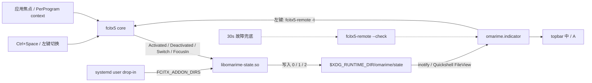

# omarime

为 Omarchy 打造的一等中文输入体验：**现代 libime 语言模型、越用越懂你的
用户模型，以及真正跟随 Omarchy 的候选窗口与控制界面。**

当前生产引擎：`fcitx5-pinyin (libime) + omarime E6 LM`。
E6 评测准确率 89.6%（stock 81.0%）；主题、bar 指示器和设置面板已上线。
详细研究、架构与路线图见 [PLAN.md](PLAN.md)。

## 三个承诺

1. **好输入**：句级解码、用户模型、可选 QWERTY 邻键纠错、现代语料语言模型。
2. **好切换**：保留用户选择的 `Ctrl+Space`；bar 显示 中/A，左键切换。
3. **好看且原生**：候选窗自动读取 Omarchy `colors.toml`、Hyprland 圆角和桌面字体；
   右键 bar 指示器打开原生设置面板。

## 安装

```bash
gh auth login            # 一次性：从私有 repo 下载 LM 需要认证
git clone git@github.com:forbidden-game/omarime.git && cd omarime
./install.sh          # 全自动：LM 下载 (sha256 校验) + addon + 主题 + 插件
./install.sh --undo   # 完整回滚
```

所有文件安装在用户目录 (`~/.local/share/omarime/`)，**不需要 root**。
LM 通过 `LIBIME_MODEL_DIRS` 环境变量加载，不修改系统文件。

选项：

```bash
./install.sh --lm-file /path/to/zh_CN.lm   # 手动指定 LM
./install.sh --skip-lm                     # 跳过 LM（只装 UI）
./install.sh --offline                     # 不联网，文件缺失时报错
```

部署架构详见 [docs/deployment.md](docs/deployment.md)。

## 已实现组件

| 路径 | 功能 |
|---|---|
| `lm/`, `eval/` | E6 语言模型训练与回归评测 |
| `themes/` | 从当前 Omarchy 主题生成 fcitx5 classicui SVG 主题；theme-set 自动跟随 |
| `engine/omarime-state/` | fcitx5 事件 addon；将激活、停用、切换与焦点事件写入 runtime state |
| `plugins/omarime.indicator/` | FileView 驱动的 bar 中/A 状态；左键切换、右键设置 |
| `plugins/omarime.settings/` | 云拼音、纠错、横竖排、13 组模糊音、主题重生成、用户词典重置 |
| `bin/omarime-config` | 设置面板后端；通过 Controller1.SetConfig 原子更新内存与文件 |
| `docs/` | 引擎部署、实验记录与研究结论 |

## 设置面板

右键 bar 上的 **中/A**，或运行：

```bash
omarchy-shell shell toggle omarime.settings '{}'
```

普通设置通过 DBus 原子生效、无需重启；仅用户词典重置和主题素材重载会短暂重启 fcitx5。

## 实时状态链路与依赖图



| 阶段 | 依赖 | 用途 |
|---|---|---|
| 构建时 | `cmake`, C++20 compiler, `pkg-config`, `Fcitx5Core >= 5.1` headers | 针对当前机器的 fcitx5 ABI 构建 addon |
| 运行时 | `fcitx5`, `systemd --user` | 加载 addon 并产生输入上下文事件 |
| UI | Quickshell `FileView` / `Quickshell.Io` | inotify 驱动 bar，无轮询进程 |
| 故障兜底 | `fcitx5-remote --check` | 每 30 秒检查一次；不参与正常切换链路 |

不依赖 `fcitx5-lua`，不修改 `/usr`，不维护 fcitx5 fork。安装器通过用户级
systemd drop-in 加载私有共享库；`--undo` 会恢复 drop-in、addon 配置和原始 fcitx5 配置。
