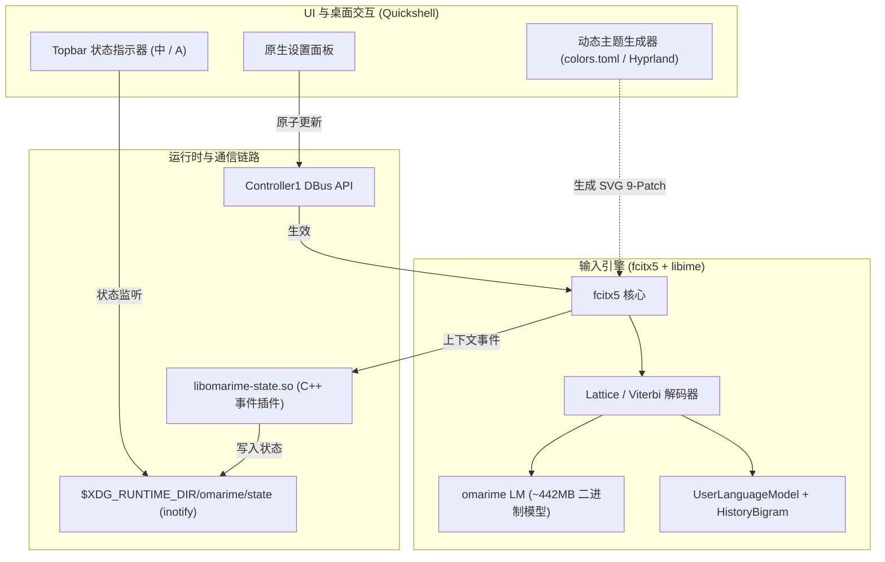

# omarime

**让 Linux 中文输入兼具现代算法、系统级美学与高效交互。**

omarime 是专为 Omarchy 及 Wayland 桌面打造的现代中文输入解决方案。项目基于 fcitx5 与 libime 解码架构，通过自研训练的亿级现代语料语言模型（omarime LM）与深度打磨的 Quickshell 原生交互层，解决传统 Linux 中文输入法模型陈旧、候选生硬与桌面割裂等痛点。

---

## 核心特性

### 1. 现代语言模型与智能解码
- **自研现代语言模型**：基于 8,300 万句现代多领域语料训练，替换十余年前的陈旧语料，首选句准确率（Top-1 P@1）从官方原版的 81.0% 提升至 89.6%。
- **句级 Lattice 解码**：依托 libime 的 Viterbi / Beam Search 解码器，实现流畅的长句输入与上下文预测。
- **在线自适应学习**：结合 libime UserLanguageModel 与 HistoryBigram 机制，动态学习用户输入习惯与专属词汇。
- **智能容错与模糊音**：支持 QWERTY 键盘邻键纠错及 13 组常用模糊音。

### 2. 原生美学与桌面集成
- **动态主题生成**：自动提取 Omarchy `colors.toml` 色板、Hyprland 窗口圆角与系统等宽字体生成 9-Patch 主题，随系统主题切换自动生效。
- **内嵌式 Preedit**：输入编码直接收敛在候选窗内部，消除多余光标跟随框。
- **排版支持**：支持现代横排与典雅竖排候选布局。

### 3. 事件驱动与轻量交互
- **零延迟 Topbar 状态**：通过 C++ Addon 监听输入上下文，直写 Runtime 状态并通过 Quickshell inotify 单帧响应（中/A 切换），零后台轮询开销。
- **图形化设置面板**：右键状态指示器即可呼出原生设置菜单，通过 D-Bus 原子更新配置，无需重启输入法。
- **独立应用状态**：支持 `PerProgram` 状态隔离，不同窗口独立记忆中英文状态。

---

## 语言模型训练与评测

### 数据集与训练流水线

官方 fcitx5 预装语言模型主要基于早期语料（约 2008 年），三元组规模仅 219 万条，难以应对现代中文表达。omarime 重新构建了现代多领域语料与训练管线：

1. **语料组成（共计 8,303 万句）**：
   - **维基百科 (zhwiki)**：4,417 万句，提供基础实体与规范表达覆盖。
   - **影视对白 (OpenSubtitles)**：725 万句，增强口语交流与日常对话流畅度。
   - **网络语料 (ChineseWebText 2.0)**：3,160 万句，覆盖现代科技、职场与综合资讯。
   - **专项语料（新闻与文旅）**：59 万句，增强地域与领域专有名词。
2. **清洗与分词对齐**：
   - 过滤 HTML 及非汉字噪点，规范化分句边界。
   - 分词词表与 libime 解码词典（`sc.dict`，约 30 万词条）保持严格同源对齐，避免切词错位与长词碎片化。
3. **模型构建**：
   - 使用 KenLM 训练 3-gram 模型，采用 `0 0 1` 剪枝策略去除低频噪声。
   - 经 `libime_slm_build_binary` 构建 4-bit 量化 trie 结构二进制模型（约 442 MB），并同步派生词级预测模型。

### 评测表现 (Benchmarks)

使用 `omarime-eval` 驱动底层 libime 解码器，在覆盖 7 个领域的 269 句标准分桶测试集上评估首选句准确率（Top-1 P@1）：

| 测试域 | 样本量 | 官方原版 (Stock LM) | omarime LM | 准确率提升 |
|---|---|---|---|---|
| 日常口语 | 94 | 92.6% | **98.9%** | +6.3% |
| 时事新闻 | 50 | 96.0% | **100.0%** | +4.0% |
| 科技数码 | 35 | 91.4% | **97.1%** | +5.7% |
| 职场公文 | 20 | 75.0% | **80.0%** | +5.0% |
| 网络热词 | 25 | 68.0% | **76.0%** | +8.0% |
| 文旅地理 | 15 | 40.0% | **86.7%** | +46.7% |
| 人名专名 | 30 | 43.3% | **53.3%** | +10.0% |
| **全场景综合** | **269** | **81.0%** | **89.6%** | **+8.6%** |

---

## 安装与卸载

安装器采用非侵入设计，所有文件安装在用户目录（`~/.local/share/omarime/`），通过 systemd user drop-in（`LIBIME_MODEL_DIRS`）加载模型，**无需 root 权限，不修改任何 `/usr` 系统文件**。

```bash
git clone https://github.com/forbidden-game/omarime.git && cd omarime
./install.sh
```

可选参数：
- `./install.sh --lm-file /path/to/zh_CN.lm`：使用本地已下载的语言模型。
- `./install.sh --skip-lm`：仅安装 UI 与插件组件（跳过语言模型）。
- `./install.sh --offline`：离线模式（本地缺少模型时直接退出）。
- `./install.sh --undo`：完整卸载并还原历史配置。

> 快捷键、模糊音、纠错算法及横竖排布局等所有配置项均可在托盘/顶栏指示器的设置面板中直接调整。

---

## 架构概览



---

## License 与致谢

- 核心代码遵循 MIT 许可证。
- 感谢 [fcitx5](https://github.com/fcitx/fcitx5) 与 [libime](https://github.com/fcitx/libime) 提供的输入框架与解码算法支持。
- 语料与词库数据遵循各自原始开源及科研授权协议。

